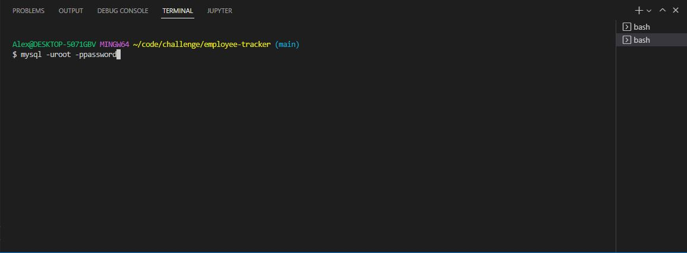
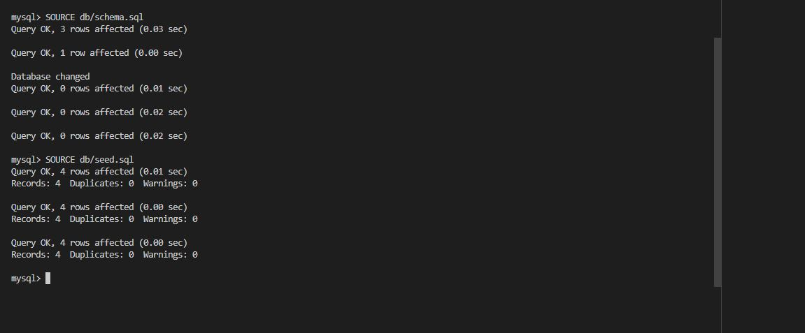
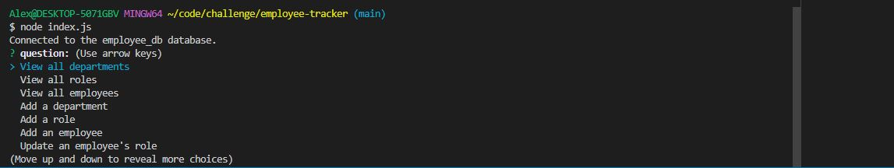
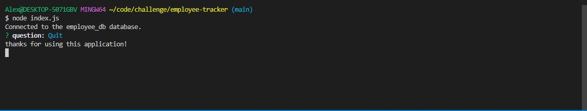
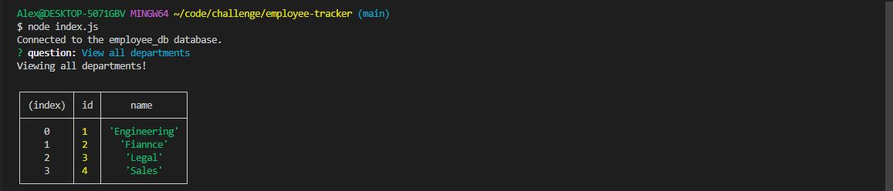

# Employee Tracker

## Description

The reason behind this application is to build a employers front page that could display different employee information depending on the inputs placed in the integrated terminal.

## Installation

When downloaded from github, the package.json will already be prepared. All that needs to be done is run the integrated terminal in the Develop Folder and enter
```
npm i
```
This will download the library necessary to run the program.

if starting with only the index file, in the integrated terminal run the code
```
npm init
```
and follow it with
```
npm install inquirer
npm install fs
```

## Usage

- To start, open the integrated terminal and input node index.js. When inpuptted, the first console.log will state "To begin making your employee front page, we will start with your manager". Answer each by inputting an answer and hitting ENTER when the question is answer.



- After the manager info has been placed, you can select to add either an engineer or an intern.



- When either is selected, answer the prompts. Once finished, you can add another employee, or quit



- If 'Quit' is selected, the program will state 'thanks for using this application!' and "Worked!" to state that the index.html files has been made with the information inputted in the field.



- Viewing the html page, we can see that the following information had been saved to the index.html file. There are hyperlinks to open your default email app when emails are clicked and engineer's github accounts are linked to the page as well.



- Refer to the [video](https://drive.google.com/file/d/1XDyyw-4Jhcy7HBomuoFSEDnIXYGTpFTK/view) to see the program step by step.

- See the file EXAMPLE.html to see a file made with the program.

# Test

Feel free to run the program as many times as you want trying different inputs. Just know for everytime the program runs, the original file will be overwritten if it is not re-named.