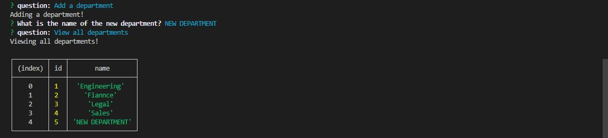

# Employee Tracker

## Description

The reason behind this application is to build a employers front page that could display different employee information depending on the inputs placed in the integrated terminal.

## Installation

When downloaded from github, the package.json will already be prepared. All that needs to be done is run the integrated terminal in the Develop Folder and enter
```
npm i
```
This will download the library necessary to run the program.

if starting with only the index file, in the integrated terminal run the code
```
npm init
```
and follow it with
```
npm install inquirer
npm install fs
```

## Usage

- To start, open the integrated terminal and start mysql by inputting your password.


- run the schema.sql and seed.sql to use the database, generate the table, and seed the data.


- exit out of mysql and start node index.js. A prompt will begin that allows you to view and create departments, roles, or employees


- a viewed section looks like the following in a table format


- a create prompt asks questions that you fill out. Once filled out, viewing the table allows you to see the changes



- If 'Quit' is selected, the program will state 'thanks for using this application!'. The terminal can then be trashed.


- Refer to the [video](https://drive.google.com/file/d/1XDyyw-4Jhcy7HBomuoFSEDnIXYGTpFTK/view) to see the program step by step and how each function works.

# Test

Feel free to run the program as many times as you want trying different inputs. Just know for everytime the program runs, the original file will be overwritten if it is not re-named.

# Future Implimentations

The goal would be to select a department, role, and employee name to change. However, sense the primary key was linked to the id's of each one, it would require more indepth query's in JS. 